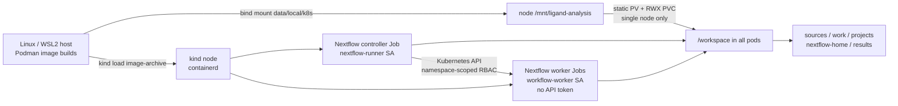

# Local Kubernetes (M4)

M4 runs the same [Nextflow workflow](../main.nf) and [scientific settings](../configs/demo.yaml) as the [Podman demo](../README.md), with a single-node kind cluster as its execution target. The cluster is disposable; its data directory is not. See the [implementation plan](../plan/infrastructure-local-kubernetes-4.md) for acceptance checks and [progress](progress.md) for measured results.

## Architecture



```mermaid
sequenceDiagram
    participant H as Linux host
    participant K as kind API
    participant R as Nextflow controller
    participant W as ML/Chem worker Jobs
    participant V as Host-backed PVC
    H->>K: Create cluster, namespace and storage
    K->>V: Two simultaneous pods exchange probe file
    H->>K: Load revision-matched images; submit runner Job
    R->>V: Read workflow, snapshot and resume cache
    R->>K: Submit bounded worker Jobs
    W->>V: Read inputs; write task work and outputs
    R->>V: Publish reports and persistent history
    H->>K: Delete/recreate kind node (retain host directory)
    H->>K: Reload images; submit controller with -resume
    R->>V: Reuse completed worker tasks
```

The `ReadWriteMany` claim in [storage.yaml](../deploy/k8s/storage.yaml) maps one host directory into **one node**. It permits multiple local pods to read and write there; it is not multi-node shared storage. A real multi-node deployment needs a shared filesystem or a separate staging architecture. DVC's local remote is not a live Nextflow work filesystem.

## Prerequisites and preparation

Run these commands from a **Linux shell** in the repository root. On Windows, use a Linux/WSL2 environment whose Podman provider can bind-mount the same resolved repository directory into kind. Do not assume `C:\` paths, a WSL distro path, the Podman Machine VM path and the node path are interchangeable. The storage probe must pass through the actual mount chain before the molecular workflow starts.

- A running Podman service; `kind` (Podman provider), `kubectl`, `git`, `bash`, and the project OCI images. Verify versions with `podman version`, `kind version`, and `kubectl version --client`. Use the tool versions recorded in [progress.md](progress.md) for a validated installation; do not assume a different host/version has been exercised.
- If you installed `kind` and `kubectl` into a user-local tools directory in Podman Machine, add that directory to `PATH` in the **same Linux shell** before running the scripts; for this workstation, `export PATH="$HOME/.local/m4-tools:$PATH"`. PowerShell's PATH does not carry over to the Linux VM.
- At least 4 CPUs, 6 GiB available memory and 20 GiB free disk for the single-node smoke test. [kind.sh](../scripts/kind.sh) checks the live Podman host before creating a cluster; for WSL-backed Podman Machine, its nominal configured memory value is not the Linux VM's effective allocation. Its probe also validates persistent-file ownership and write access in the controller image. Scientific containers run with their locked open-source tools.
- On this workstation's Windows-drive/Podman Machine mount, Linux UID/GID ownership is **not preserved** across the host/node/pod boundary: a file written by the worker appears as `0:0` inside the pod even though the pod runs as `57439:57439`. The two-pod probe reports `ownership=not-preserved-drvfs` and still requires exact contents plus successful create/read/delete at the intended UID/GID. On a Linux filesystem that preserves ownership, the same probe requires the file owner to match the runner. Do not assume this mapping on another host; fail and inspect the probe if permissions or content checks disagree.
- The DVC ADRB2 source snapshot, or a network connection for the first fetch. To reproduce the same inputs as Podman, restore [adrb2.dvc](../data/sources/adrb2.dvc) first and **copy** its materialized `data/sources/adrb2` snapshot into `data/local/k8s/sources/adrb2`; do not make symlinks into the DVC cache or a path unavailable to worker pods.
- Build the three local images from the **same** source revision using the [README build commands](../README.md). The source revision recorded in each OCI image must match the revision passed to the controller. Rebuild `ligand-runner` without stale build cache when revising workflow files. The image build must include the `nf-k8s` plugin for offline controller execution.

The [ignored data directory](../data/local/) contains the host-backed PVC under `data/local/k8s/`, including `sources/`, `results/`, `work/`, `projects/`, `nextflow-home/`, image identity and acceptance evidence. Never commit this directory or include it in an OCI build. Cluster teardown removes only named cluster resources, not the host directory.

For a Windows linked worktree, Git's `.git` pointer may use a `C:\` path that Linux Git cannot resolve. The kind setup script translates that pointer for worktree checks. The acceptance script exports `LIGAND_REVISION` for the image/controller scripts and `LIGAND_ANALYSIS_REVISION` for the [Podman launcher](../scripts/nextflow.sh), using the verified image revision instead of an `unknown` Linux Git lookup. This does not change scientific parameters.

## Execute

```bash
scripts/kind.sh up                    # create one-node cluster, static PVC, concurrent storage probe
scripts/k8s-images.sh load            # export Podman builds and load the exact images into kind
scripts/k8s-images.sh verify          # verify revision, image identity and containerd tags
scripts/k8s-demo.sh run               # controller submits ML and chemistry worker Jobs
scripts/k8s-demo.sh status            # namespace worker status, controller logs, report path
scripts/k8s-demo.sh resume            # reuses the persisted Nextflow work and history
scripts/kind.sh down                  # delete only the named cluster; preserve data/local/k8s
```

The underlying controller command is `nextflow run main.nf -profile k8s -params-file configs/demo.yaml --sources_dir /workspace/sources --outdir /workspace/results/adrb2-demo -work-dir /workspace/work`; resume adds `-resume`. The Kubernetes profile in [k8s.config](../conf/k8s.config) disables Podman tasks, mounts the same PVC at `/workspace` in controller and workers, limits queued tasks to two, sets CPU limits, and retains completed Jobs for acceptance evidence (`k8s.cleanup = false`). Docking uses the configured `params.dock_cpus` (default 2). The controller uses a dedicated namespace-scoped account; workers use a separate account without an API token. No Kubernetes pod mounts a Podman socket.

Inspect failures with `scripts/k8s-demo.sh status`, `kubectl -n ligand-analysis get jobs,pods`, `kubectl -n ligand-analysis describe pod POD_NAME`, and `kubectl -n ligand-analysis logs JOB_OR_POD_NAME`. A failed worker must be investigated before retrying. The report at `data/local/k8s/results/adrb2-demo/report/report.html` is successful only if the final `CHECK_REPORT` task accepts its explicit outcome records; prior results must not be mistaken for a new successful run.

## Acceptance and durable resume

Run `scripts/k8s-acceptance.sh all` **only when it is safe to delete/recreate the named kind cluster**. It runs the existing Podman demo offline on the pinned ADRB2 snapshot, runs the Kubernetes demo with the same images and [configuration](../configs/demo.yaml), compares both outputs, records host-backed checksums, recreates the node, reloads the images, resumes the same controller launch directory, and checks for cached worker tasks. It never removes the host-backed sources, work, results or cache. `scripts/k8s-acceptance.sh compare` only compares two already-completed demos.

The [comparison code](../scripts/k8s_compare.py) requires **exact** input snapshot object hashes, input outcome identities, split assignments, feature row identities and matrix values, predicted classes, six-decimal class-1 scores and raw confusion counts. Pose selections must retain their identities; generated Vina scores may differ by at most **0.01 kcal/mol**, and heavy-atom pose RMSD is measured in place with symmetry-equivalent atom matches (no independent alignment), at most **0.10 Å**. Comparison output is `data/local/k8s/acceptance/comparison.json`. These thresholds check execution reproducibility, not model generalization. The 20-ligand demo remains a molecular smoke test, not a scientific benchmark.

If image verification, PVC binding, RBAC checks or any worker fails, stop and retain logs/evidence. Restart tests compare persistent file checksums **before** rerunning resume; report and execution trace may then change with controller metadata. Only [progress.md](progress.md) records which of these checks actually passed in this environment.
